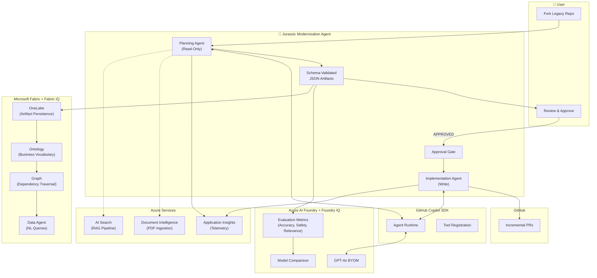

# Jurassic Modernization Agent

**Modernization Intelligence Layer** — A 2-agent system that automates legacy codebase modernization using GitHub Copilot SDK and Azure AI Foundry.

---

## Problem Statement

Large enterprises operate mission-critical legacy systems:
- 10–30 year-old control logic with sparse documentation
- Proprietary DSLs and cyclic dependencies  
- Safety-critical code paths with minimal test coverage
- Institutional knowledge locked in senior engineers

Modernization efforts stall because:
- Nobody fully understands system boundaries
- Risk is opaque and audit scrutiny is high
- Refactoring introduces operational risk
- Re-platform attempts are expensive and slow

**The result:** Technical debt accumulates, transformation slows, and enterprises remain trapped on aging platforms.

---

## Solution

Jurassic Modernization Agent embeds GitHub Copilot SDK's agentic capabilities into a structured, enterprise-safe workflow:

```
┌──────────────────┐         ┌──────────────────┐         ┌──────────────────────┐
│  Planning Agent  │         │   Human Review   │         │ Implementation Agent │
│   (read-only)    │────────▶│   & Approval     │────────▶│  (write after appr.) │
└──────────────────┘         └──────────────────┘         └──────────────────────┘
```

### Two-Agent Architecture

| Agent | Mode | Responsibility |
|-------|------|---------------|
| **Planning Agent** | Read-only | Analyzes codebase, builds dependency graphs, detects cycles (Tarjan's SCC), scores risk, generates phased modernization plans |
| **Implementation Agent** | Read-write (after approval) | Executes approved plan — refactoring code, upgrading dependencies, writing tests, creating incremental PRs |

### Key Capabilities

1. **Semantic Understanding** — Builds complete dependency graphs for C/C++, Python, and JavaScript/Vue
2. **Risk Intelligence** — Scores every file by churn × complexity × safety criticality
3. **Test Scaffolding** — Identifies testable entry points and generates starter templates
4. **Modernization Roadmap** — Produces phased migration plans with task dependencies
5. **Full Audit Trail** — Every action logged for enterprise governance compliance
6. **Model Evaluation** — Tracks agent quality via Azure AI Foundry IQ metrics

---

## Architecture Diagram



---

## Prerequisites

### Required

| Requirement | Version | Notes |
|-------------|---------|-------|
| Node.js | 20+ | Runtime |
| pnpm | 8+ | Package manager |
| Azure CLI | Latest | For `az login` authentication |
| Git | Latest | Fork and clone target repos |
| GitHub Account | — | With fork of target legacy repo |

### Azure Services

| Service | Environment Variable | Purpose |
|---------|---------------------|---------|
| Azure AI Foundry | `AZURE_AI_PROJECT_ENDPOINT` | GPT-4o model hosting |
| Application Insights | `APPLICATIONINSIGHTS_CONNECTION_STRING` | Telemetry & tracing |
| Document Intelligence | `AZURE_DOCUMENT_INTELLIGENCE_ENDPOINT` | PDF/doc ingestion (optional) |
| Azure AI Search | `AZURE_SEARCH_ENDPOINT` | RAG pipeline (optional) |

### Optional (for persistent storage)

| Service | Environment Variable | Purpose |
|---------|---------------------|---------|
| Microsoft Fabric | `FABRIC_WORKSPACE_ID`, `FABRIC_LAKEHOUSE_ID` | Cross-run analytics & governance dashboards |

---

## Setup Instructions

### 1. Clone and Install

```bash
git clone https://github.com/your-org/jurassic-refactor.git
cd jurassic-refactor
pnpm install
pnpm build
```

### 2. Authenticate with Azure

```bash
az login
```

Ensure your identity has the required RBAC roles:

| Resource | Required Role |
|----------|---------------|
| AI Foundry Project | `Cognitive Services User` |
| Application Insights | `Monitoring Metrics Publisher` |
| Container Registry | `AcrPush` |
| Fabric Workspace (optional) | `Contributor` |
| OneLake (optional) | `Storage Blob Data Contributor` |

### 3. Configure Environment

```bash
# Required
export AZURE_AI_PROJECT_ENDPOINT="https://your-project.cognitiveservices.azure.com"
export APPLICATIONINSIGHTS_CONNECTION_STRING="InstrumentationKey=..."

# Optional - for Fabric storage
export JURASSIC_STORAGE_PROVIDER=fabric  # default: local
export FABRIC_WORKSPACE_ID="your-workspace-id"
export FABRIC_LAKEHOUSE_ID="your-lakehouse-id"

# Optional - for RAG pipeline
export AZURE_SEARCH_ENDPOINT="https://your-search.search.windows.net"
export AZURE_DOCUMENT_INTELLIGENCE_ENDPOINT="https://your-doc-intel.cognitiveservices.azure.com"
```

### 4. Fork Your Target Repository

Fork the legacy codebase you want to modernize to your GitHub account. The agent never touches upstream.

---

## Deployment

### Option A: Azure Developer CLI (Recommended)

```bash
azd up
```

This provisions all Azure resources via Bicep IaC:
- Azure OpenAI with GPT-4o deployment
- Application Insights + Log Analytics
- Azure Container Registry
- Azure Container Apps

### Option B: Manual Bicep Deployment

```bash
az deployment sub create --location eastus2 \
  --template-file infra/main.bicep \
  --parameters infra/main.parameters.json
```

### Option C: Local Development

```bash
pnpm build
npx jurassic plan --fork-owner <your-username> --interactive
```

---

## Usage

### Planning Agent (Read-Only Analysis)

```bash
npx jurassic plan --fork-owner alice --interactive
```

The agent:
1. Clones your fork
2. Builds dependency graphs (C/C++, Python, JS/Vue)
3. Detects circular dependencies (Tarjan's SCC)
4. Scores risk per file (churn × complexity × safety)
5. Asks clarifying questions in interactive mode
6. Produces 9 schema-validated JSON artifacts

### Review Artifacts

Artifacts are written to `artifacts/<runId>/planning/`:

| Artifact | Review Focus |
|----------|--------------|
| `ModernizationPlan.json` | Task order and scope |
| `RiskAssessment.json` | High-risk files get extra tests? |
| `DependencyGraph.json` | All dependencies captured? |
| `MigrationOptions.json` | Trade-offs acceptable? |

### Approve the Plan

```bash
touch artifacts/<runId>/planning/APPROVED
```

### Implementation Agent (Code Changes)

```bash
npx jurassic implement --fork-owner alice --plan-approved
```

The agent:
1. Reads the approved plan
2. Executes each migration task
3. Creates incremental PRs on your fork
4. Logs all changes to `ImplementationLog.json`

### Review and Merge PRs

Each PR is small and focused. Review the diff, run CI, merge at your pace.

---

## Responsible AI Notes

### Safety Guardrails

| Guardrail | Implementation |
|-----------|----------------|
| **Human-in-the-loop** | All plans require explicit approval before code changes |
| **Fork isolation** | Changes only affect user's fork, never upstream |
| **Read-only by default** | Implementation requires `--plan-approved` + `--enable-writes` flags |
| **Audit trail** | Every skill invocation logged with inputs/outputs |
| **PII redaction** | Emails, SSNs, phone numbers, IPs masked before persistence |
| **Confidence scoring** | All skills emit confidence values (0–1) for transparency |

### Data Handling

- **No code exfiltration** — All analysis stays within tenant boundaries
- **Passwordless auth** — `DefaultAzureCredential` only; no API keys in code
- **RBAC enforcement** — All Azure resources use `disableLocalAuth: true`

### Model Evaluation

Azure AI Foundry IQ tracks:
- **Accuracy** — Artifact correctness vs. ground truth
- **Groundedness** — RAG validation of generated content
- **Hallucination detection** — Identifies unsupported claims
- **Determinism** — Same inputs produce identical outputs
- **Confidence distribution** — Calibration of skill confidence scores

### Limitations

- Requires human review for all code changes
- Cannot guarantee 100% detection of all dependencies (especially dynamic imports)
- Risk scoring is heuristic-based; human judgment required for final prioritization
- Large monorepos may require chunked analysis

---

## Skills Reference

### Planning Skills (26 total)

| Skill | Purpose |
|-------|---------|
| `repo_snapshot` | Fork-aware file indexing with language detection |
| `fw_include_graph` | C/C++ include graph with Tarjan SCC cycle detection |
| `py_import_graph` | Python import graph with external dependency tracking |
| `gui_import_graph` | JS/Vue import graph with component detection |
| `git_churn` | Git history hotspot analysis |
| `complexity_metrics` | Code complexity per file |
| `risk_scoring` | Per-file risk scoring |
| `safety_path_analysis` | Safety-critical code detection |
| `stack_fingerprint` | Technology stack identification |
| `doc_coverage_analysis` | Documentation gap analysis |
| `plan_synthesis` | Phased modernization plan generation |
| `user_dialog` | Interactive Q&A capture |
| `policy` | Governance rule enforcement |

### Implementation Skills

| Skill | Purpose |
|-------|---------|
| `code_refactor` | Language-aware transformations |
| `migration_executor` | Plan phase execution |
| `dependency_upgrader` | npm/pip version upgrades |
| `test_writer` | Test code generation |
| `test_scaffold` | Test entry point identification |
| `pr_writer` | PR description generation + GitHub API |
| `incremental_pr` | Fork-aware PR creation |
| `doc_ingest` | PDF/document ingestion |
| `report_generator` | HTML visualization |

---

## Artifact Schemas

All 12 schemas in `specs/schemas/` are validated with Ajv:

| Schema | Producer | Purpose |
|--------|----------|---------|
| `Manifest` | Both | Run metadata |
| `RunLogEvent` | Planning | Skill invocation log |
| `DependencyGraph` | Planning | Source file dependencies |
| `StackAnalysis` | Planning | Technology inventory |
| `RiskAssessment` | Planning | Per-file risk scores |
| `MigrationOptions` | Planning | Migration path candidates |
| `UserDecisions` | Planning | Captured user responses |
| `DocCoverage` | Planning | Documentation gap analysis |
| `ModernizationPlan` | Planning | Phased migration plan |
| `ImplementationLog` | Implementation | Code change log |
| `TestScaffold` | Implementation | Test templates |
| `EvaluationReport` | Foundry | Quality metrics |

---

## License

MIT — See [LICENSE](../LICENSE)
